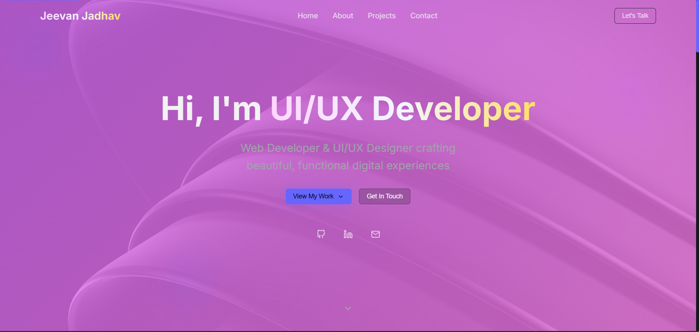
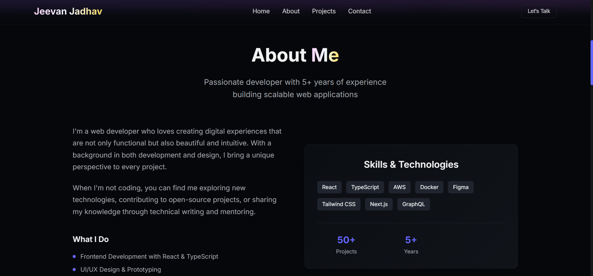

# Portfolio Template 3

A clean, single-page **static portfolio template** built with plain HTML, CSS and JavaScript. This repository contains a ready-to-use template that you can customize with your own name, projects, images and links — perfect for quickly publishing a personal portfolio site.

---

## Preview





---

## Features

* Single HTML file (`Portfolio3.html`) – easy to edit and deploy.
* Clean, modern and responsive layout built with HTML, CSS and vanilla JavaScript.
* Included CSS (`style3.css`) and JS (`script3.js`) files for styling and interactive behaviour.
* Example images used for avatar/background (replace with your own): `Jeevan.jpg`, `Zhongli.jpg`, `bg.jpg`.
* MIT License included.

---

## Getting started

### Prerequisites

No build tools or package managers are required — everything is static.

### Run locally

1. Clone the repository:

```bash
git clone https://github.com/NOVA0206/Portfolio-Template-3.git
cd Portfolio-Template-3
```

2. Open `Portfolio3.html` in your browser (double-click the file or `right click → Open with` your browser).

## Customization guide

* **Change text content & links**: Edit `Portfolio3.html` — replace the name, bio, social links and project entries.
* **Replace images**: Swap the image files in the repository (`Jeevan.jpg`, `bg.jpg`, etc.) or update the `` `src` attributes in the HTML.
* **Modify styles**: Edit `style3.css` to change colors, spacing and typography.
* **Add / change interactivity**: Edit `script3.js` to update animations, navigation behaviour, or add new interactive components.

---

## Deploying

You can host this on any static host (GitHub Pages, Netlify, Vercel static sites, Firebase Hosting, Surge, etc.). For GitHub Pages, push the repo to a GitHub account and enable Pages in repository settings, selecting the `main` branch and `/ (root)` folder.

---

## License

This project is released under the **MIT License**. See the `LICENSE` file for details.

---

## Contact
Author: Jeevan Jadhav

Email: jeevanj020604@gamil.com.com

GitHub: https://github.com/NOVA0206
